# Prismatix — Project Management Web App

> Multi-project, multi-user project-management platform covering the full delivery lifecycle:
> **Charter → WBS/Schedule → Cost → Risk → Change Control → EVM/Forecast → Closure**, aligned to PMBOK.
> Each project's modules are organized under the **five PMBOK process groups** — Initiating · Planning · Executing · Monitoring & Controlling · Closing.

Prismatix gives PMs, PMO and finance one clear, role-aware view of project **health, cost, schedule and risk** —
turning scattered updates into Earned Value insight (CPI/SPI), resource utilization and an auditable trail.

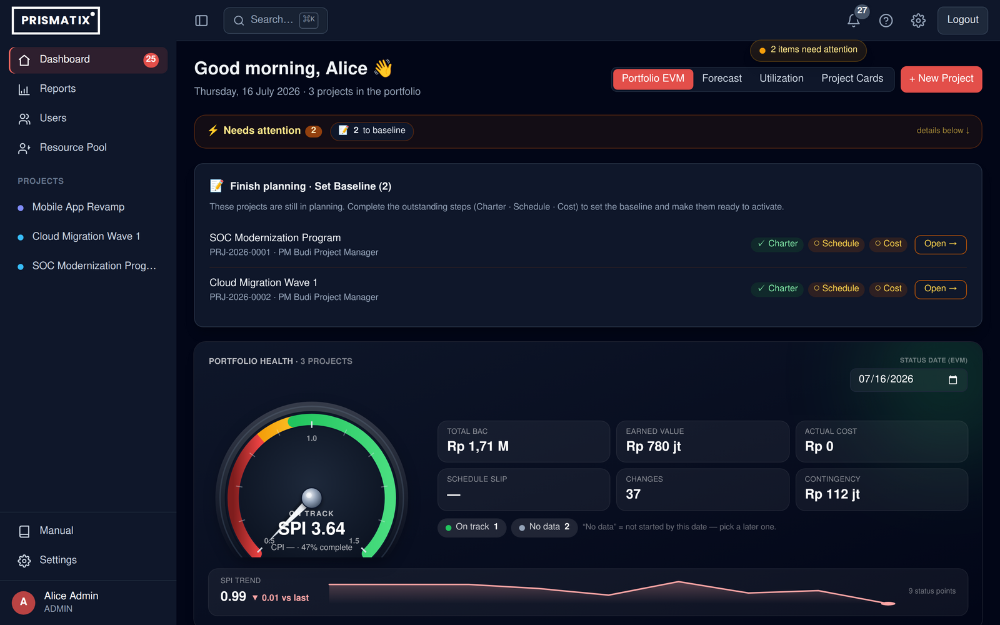

<p align="center"><em>Portfolio dashboard — a compact KPI stat strip, EVM health & status distribution, activity and resource load.</em></p>

> **Naming:** "Prismatix" is the user-facing brand (formerly PRIMA → Precise). Internal identifiers
> stay `prima*` on purpose (repo dir, DB `prima_pm`, systemd unit, `prima_*` localStorage keys) — do not rename them.

---

## ✨ Features

- **PMBOK process-group workspace** — inside a project, modules are grouped under five phase tabs: **Initiating** (Charter · Kick-Off · Stakeholders), **Planning** (Schedule · Agile · Cost · Procurement · Risk), **Executing** (Timesheet · RAID · Issues · UAT · Change Request), **Monitoring & Controlling** (Forecast · EVM Trend) and **Closing** (Closeout), with a cross-cutting **Audit** tab.
- **Role-aware dashboard** — Admin/PMO get **Portfolio EVM** (a compact KPI **stat strip**, CPI/SPI, status & health charts, activity-by-project, resource load); **Project Managers** get a *"My Projects"* view with elegant **CPI/SPI donut charts** and a **baseline-vs-actual progress** chart — plus a Resource **Utilization** heatmap and project cards. Personalised, time-based greeting (auto **ID/EN**).
- **⌘K Command Palette** — jump to any project, page or quick action from anywhere (**Ctrl/⌘ K**), keyboard-first.
- **Project Charter** — goals, scope, sponsor, high-level cost, and the **delivery approach** (Predictive / Agile / Hybrid) chosen at initiation; committing locks a baseline and unlocks the other modules.
- **Agile & Hybrid delivery** — product **backlog**, **sprints**, and a **Kanban board with smooth drag-and-drop**; **velocity** & **burndown** reports; **Agile-EVM** (story-point based) and **Hybrid-EVM** blended into the same portfolio.
- **WBS & Schedule** (predictive) — work-breakdown tree, interactive Gantt (drag to reschedule / link dependencies), schedule **baseline & variance** (tracking Gantt), per-task progress, PIC and WBS dictionary.
- **Cost** — direct (material + manpower) & indirect costs with **inline edit** + live amount preview, management reserve, manual **Actual Cost**, and live **EVM** (EV/PV/AC, CV, **CPI**). `BAC = PMB` = cost baseline excluding management reserve.
- **Forecast** — **EAC scenarios** (optimistic / likely / pessimistic), forecast finish date & schedule variance from SPI, **projected margin**, and an **S-curve** (planned PV vs actual AC vs forecast-to-EAC). Methodology-aware, so Agile/Hybrid projects forecast on the same EVM the dashboard shows.
- **Timesheet** — a per-project **Timesheet** tab logs actual man-days against manpower lines and shows **Planned vs Earned vs Consumed** man-days and **labour efficiency** (earned ÷ consumed). Team members get a self-service **"My Timesheet"** page to log time only against the lines assigned to them.
- **Risk** — qualitative (P×I, **5×5 heatmap**) and quantitative (**EMV**, with a live preview) analysis; EMV drives the contingency reserve.
- **Change Requests & per-project Change Log** — raise → review → PMO/Admin approve/reject, with a full **lifecycle log** (requested / reviewed / decided) and charter versioning. A **chargeable** change carries an agreed amount that can be **added to project revenue on approval** (with confirmation); an approved change that impacts **cost or schedule automatically unlocks the frozen baseline** so the sanctioned edit can be applied.
- **Project lifecycle & closure governance** — governed status transitions (**Charter → Active ⇄ On-hold → Closed**, ADMIN/PMO only; on-hold requires a reason). A **closure readiness gate** hard-blocks closing until the schedule is 100% (else an ADMIN/PMO **force-close** with a mandatory reason), with advisory warnings for open CRs/risks/issues/backlog. A **CLOSED project is read-only** (its frozen BAC and data can't be mutated) with a governed **reopen** (ADMIN/PMO + reason). A **baseline lock** freezes the PMB/BAC — cost lines, WBS tasks and the schedule baseline can't change while locked (progress, actuals and risks still can); unlock is a deliberate, audited ADMIN/PMO action (or an approved change request).
- **Issue Log** — track problems that have occurred (category, impact, owner, resolution, status) per project; included in exports.
- **Audit log** — immutable, role-scoped trail of who changed what and when.
- **Notifications** — a personal **inbox** (assigned as PM, change-request submitted / decided) plus on-demand alerts (overdue tasks, high risks, budget overrun) in a portfolio bell.
- **Attachments** — upload/download files against charter, risks or the project. Uploads are restricted to a **safe type whitelist** (PDF, XLSX, DOCX, PNG, JPG), stored under server-generated filenames with a 10 MB cap.
- **Reporting Hub** — a dedicated **`/reports`** page that separates *working dashboards* (in-context, interactive) from *formal reports* (point-in-time, exportable), on a **View × Cadence** model: an **Executive** one-screen portfolio health (KPI band, RAG schedule-health distribution, worst-first project heatmap), the formal **Project Report** (schedule / cost / task completion / forecast), and **Analytics** (EVM-trend + forecast for any project) — with weekly/monthly cadence.
- **Exports** — per-project **and portfolio** **PDF** (PDFKit) and **Excel** (ExcelJS) reports incl. cost, risk, schedule, EVM and the Issue Log — pure JS, no headless browser. The PDFs are **corporate-styled**: a navy cover band + RAG status pill, an auto-written **Executive Summary (BLUF)**, a KPI band, and a per-page CONFIDENTIAL footer.
- **Resource master pool** — named/generic resources with rate cards (linkable to login accounts); cross-project **capacity & over-allocation**, and **earned vs consumed man-days + efficiency** fed from timesheets.
- **Admin** — user management (create / role / reset password / activate — with **live green/red field validation**), project (PM) reassignment, rate cards. All accounts are **admin-provisioned** — there is no open self-registration.
- **Public landing page** — a bilingual (EN/ID), **aurora-dark** homepage greets guests at `/` and introduces Prismatix before sign-in — offered as a contribution to the global project-management community. Every call-to-action leads to the login.
- **UX** — **dark mode by default** (light optional), **IDR thousand-separator inputs**, **live inline form validation** (green/red field state with strong-password checklists on auth/admin forms), native spellcheck, WCAG-minded contrast, accessible modals/toasts/confirm dialogs, skeleton loaders, responsive & mobile-friendly.

## 📸 Screenshots

**Public landing page** — the bilingual, aurora-dark front door shown to guests before sign-in.

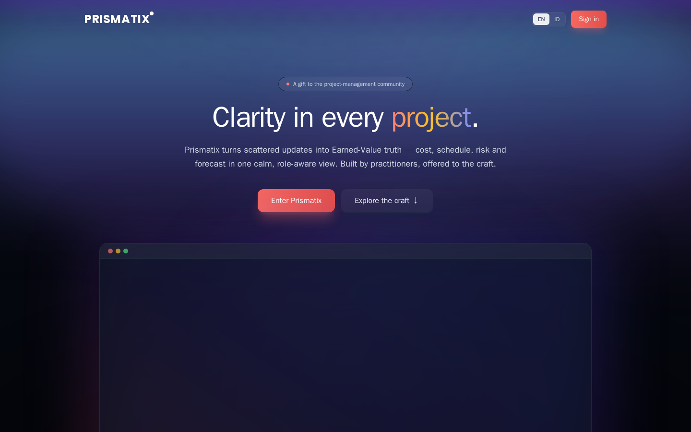

| Project Manager dashboard — CPI/SPI donuts & progress | Agile board — drag & drop Kanban |
|:---:|:---:|
| 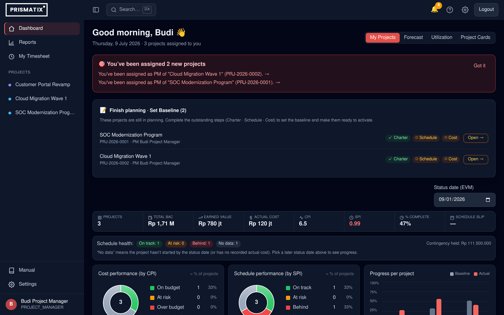 | 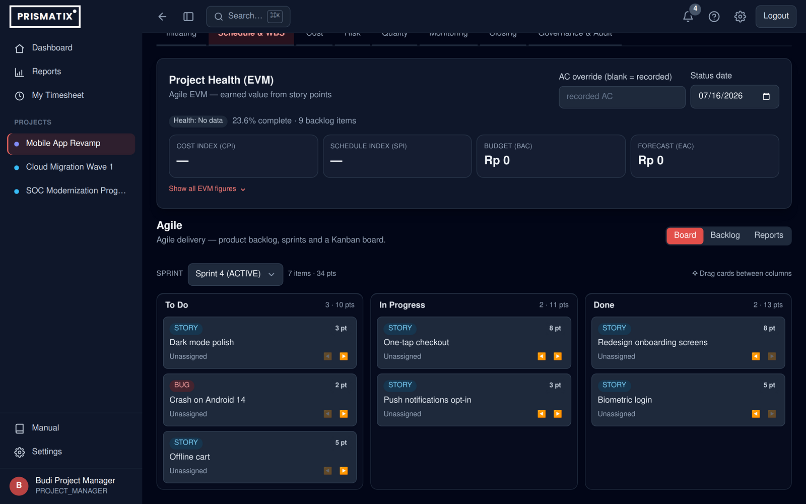 |
| **Risk — 5×5 heatmap & EMV contingency reserve** | **⌘K command palette** |
| 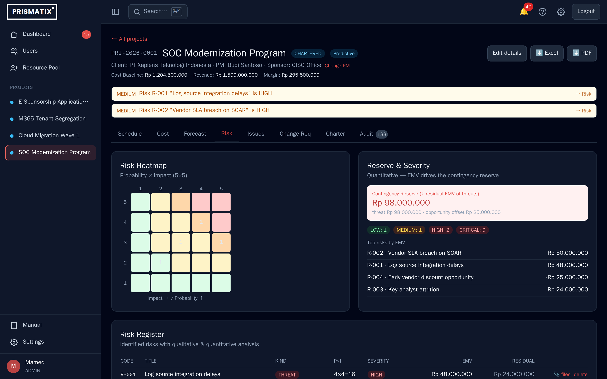 | 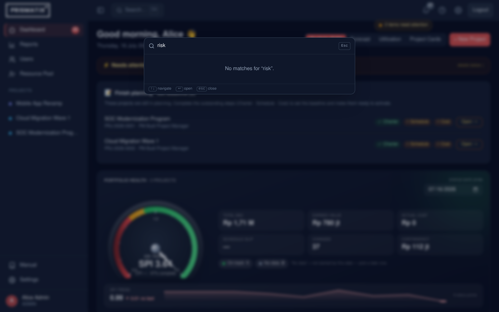 |
| **Inline form validation — live green/red feedback** | **Strong-password checklist on change password** |
| 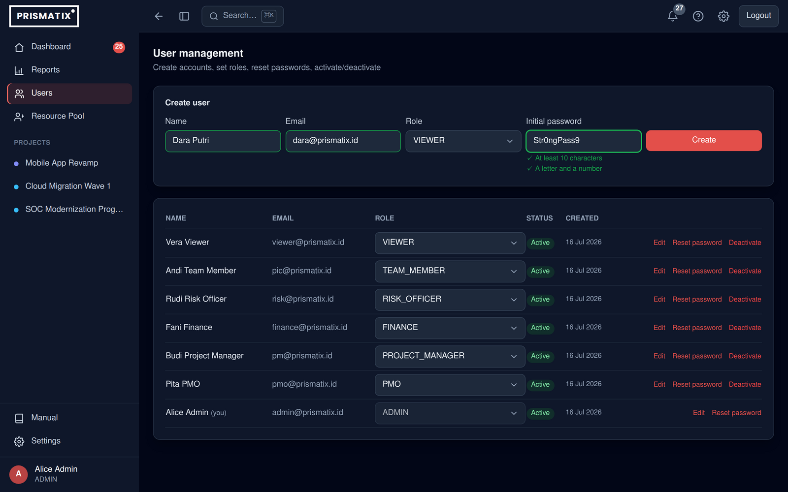 | 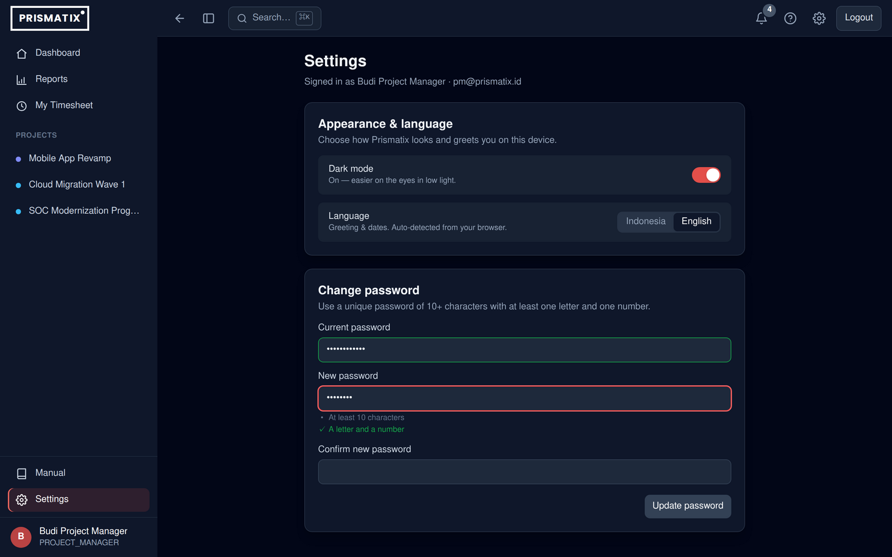 |
| **Forecast — EAC scenarios, schedule/margin forecast & S-curve** | **Timesheet — plan vs earned vs consumed man-days & efficiency** |
| 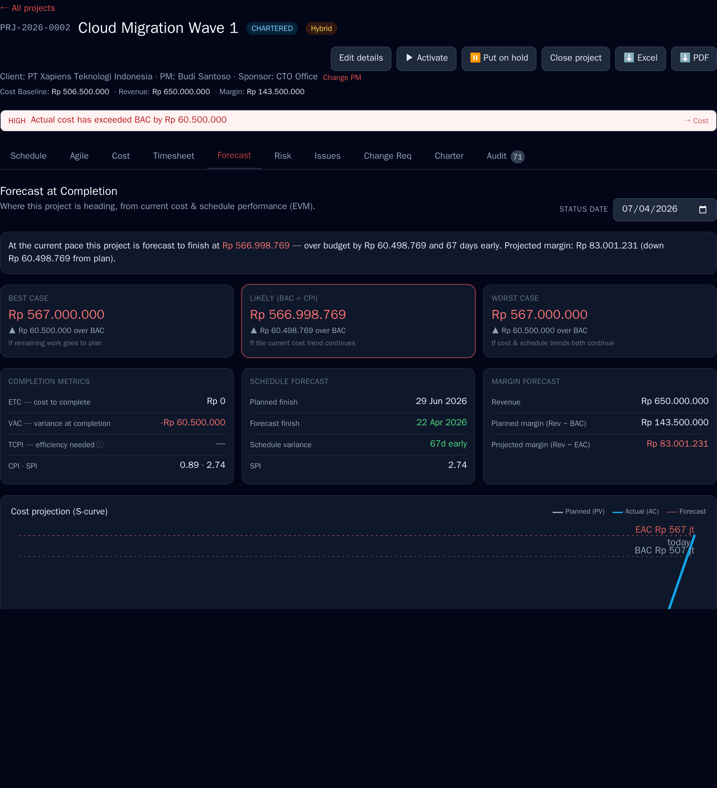 | 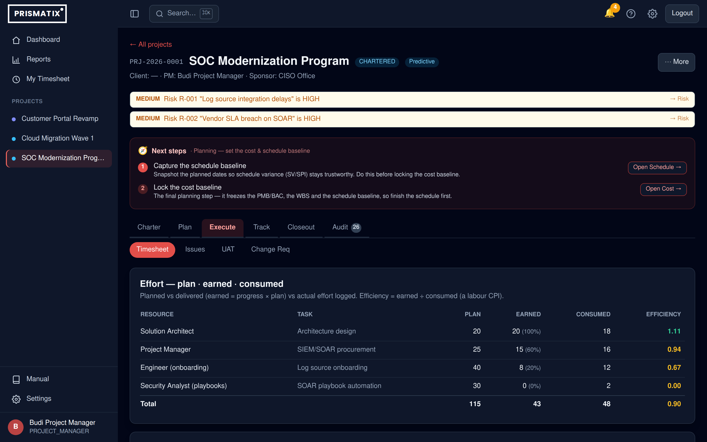 |

**Reporting Hub** — the centralized `/reports` page: an Executive one-screen portfolio health view (KPI band, RAG schedule-health distribution, worst-first project heatmap), plus formal Project Report and Analytics views, with corporate-styled PDF/Excel export.

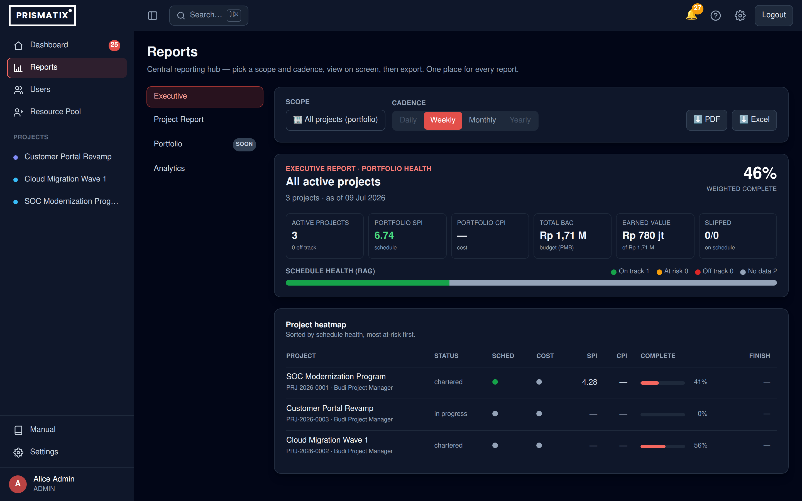

**Guided next steps** — a contextual card on every project that tells the PM what to do next for the current lifecycle stage (charter → baseline → activate → monitor → close), jumping straight to the right tab.

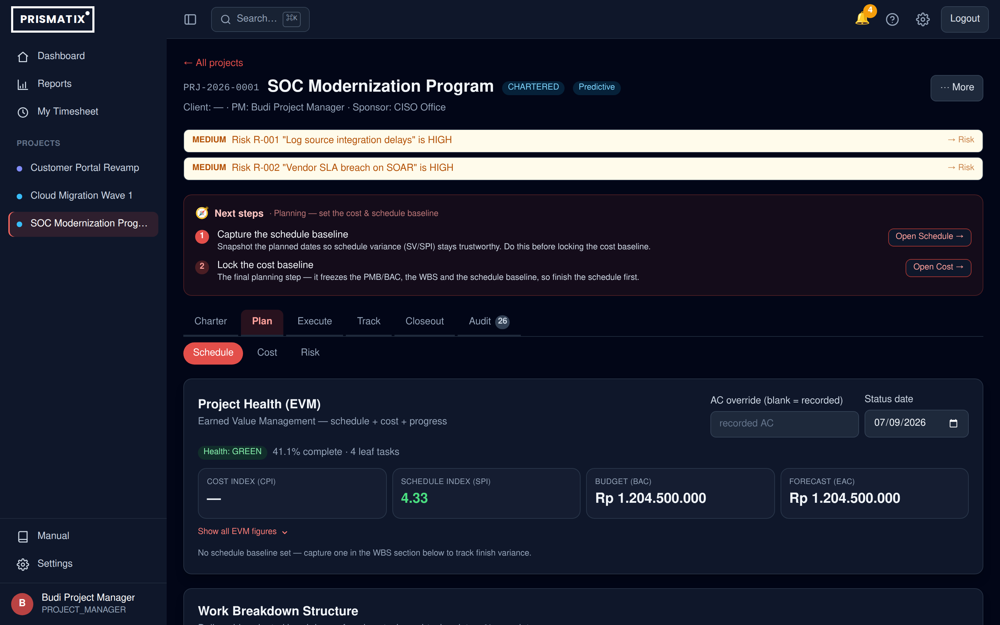

## 🧱 Tech stack

| Layer | Tech |
|------|------|
| Frontend | React 18 · Vite · TypeScript · Tailwind CSS v3 · TanStack Query · React Router |
| Backend | Node.js · Express · TypeScript · Prisma v6 |
| Database | PostgreSQL (16+) |
| Auth | JWT (access/refresh, **server-side revocation**) + **RBAC** · bcrypt · rate-limited login |
| Reports | PDFKit (PDF) · ExcelJS (Excel) |
| Tests | Vitest (unit) · Supertest (HTTP integration) · Playwright (E2E) |

## 🏛️ Architecture

- **Pure calc core** (`server/src/calc/*`): money, cost rollup, risk EMV, EVM — all pure & unit-tested. Money is `Decimal`.
- **Modular API** under `/api/v1`: `auth`, `users`, `projects`, `charter`, `cost`, `ratecard`, `risk`, `issue`, `schedule`, `agile`, `timesheet`, `forecast`, `portfolio`, `evm`, `report`, `closeout`, `resource`, `attachment`, `audit`, `notification`, `export`.
- **RBAC middleware**: role guards + project-ownership checks; functional roles (Finance/Risk) bypass ownership where appropriate.
- **Single-origin in production**: one Node process serves the **API and the built React app** from the same port, so the client's relative `/api/v1` calls need no proxy or CORS.

### Roles
`ADMIN` · `PMO` · `PROJECT_MANAGER` · `FINANCE` · `RISK_OFFICER` · `TEAM_MEMBER` · `VIEWER`

### Domain conventions (don't re-litigate)
- **BAC = PMB** = direct + indirect + contingency, **excludes** management reserve (shown separately as "Total Budget").
- **Actual Cost is entered manually**; **progress drives Earned Value**, not AC. With AC = 0, CPI shows "—".
- Contingency reserve = Σ EMV of open risks flagged "include in reserve".
- **Agile-EVM** derives % complete from **story points** (done ÷ total); **Hybrid** splits BAC between the WBS-linked (predictive) and backlog (agile) streams so nothing is double-counted.

---

## 🔒 Security

- **Accounts are admin-provisioned** — no open self-registration. Passwords are **bcrypt** (cost 12) with a strong-password policy (≥10 chars, letter + number, common-breach denylist).
- **JWT with real revocation** — short-lived access + refresh tokens carry a per-user token version; **logout, password change/reset and deactivation invalidate all outstanding tokens immediately**. `requireAuth` re-validates the account (active + version + role) on every request. Algorithm is pinned (HS256).
- **Brute-force protection** — rate-limited `/auth/login` & `/auth/refresh`. Sessions are **per browser tab** (sessionStorage), so different tabs can hold different users.
- **RBAC everywhere** — every route is role-guarded; project-scoped routes enforce ownership/soft-delete and re-scope every nested query by `projectId` (no IDOR). CLOSED projects are read-only across all modules.
- **Input & content** — **zod** validation on all mutations, **100% Prisma** (no raw SQL), a **Helmet CSP** (hashed inline script, no `unsafe-inline` scripts), and a file-upload **type/extension whitelist** with server-generated names, a 10 MB cap and a non-web-served upload dir.
- **Auditable** — an immutable audit trail records logins, auth changes and project mutations; production hides internal error details.
- **Production transport hardening** — behind a TLS reverse proxy (nginx) the app binds to loopback (`HOST=127.0.0.1`), enables **HSTS + `upgrade-insecure-requests`** (`SECURE=true`) and trusts the proxy for the real client IP (`TRUST_PROXY=1`); http→https is redirected. See `server/.env.production.example`.

---

## 🚀 Getting started (local dev)

**Prerequisites:** Node.js 20+, and PostgreSQL 16+ (or Docker).

### 1. Database
```bash
docker compose up -d            # postgres :5432 (+ adminer :8080)
```
Matches `server/.env`: user/pass `prima:prima`, db `prima_pm`. (Or point `DATABASE_URL` at any local Postgres.)

### 2. Backend (API on :4000)
```bash
cd server
cp .env.example .env            # preset for the compose DB
npm install
npm run prisma:generate
npm run migrate:deploy          # apply migrations
npm run db:seed                 # demo users + 3 fully populated projects
npm run dev
```

### 3. Frontend (Vite on :5173)
```bash
cd client
cp .env.example .env            # VITE_API_URL=/api/v1 (proxied to :4000)
npm install
npm run dev
```
Open **http://localhost:5173** and sign in with a demo account.

### Demo logins (seed only — password `Password123!`)
| Role | Email |
|------|-------|
| Admin | admin@prismatix.id |
| PMO | pmo@prismatix.id |
| Project Manager | pm@prismatix.id |
| Finance | finance@prismatix.id |
| Risk Officer | risk@prismatix.id |
| Team Member | pic@prismatix.id |
| Viewer | viewer@prismatix.id |

> Demo accounts exist only in the seed/dev DB. In a real deployment, create proper accounts and disable the demos.

---

## 📦 Production build & deploy

> **Deploying to a fresh server / VPS / cloud host?** Follow the complete step-by-step runbook in
> **[`docs/DEPLOYMENT.md`](docs/DEPLOYMENT.md)** — bare OS → PostgreSQL → build → hardened systemd
> service → **TLS via Let's Encrypt (public domain)** *or* **a local CA (LAN by IP)** → backups.
> nginx config templates live in [`deploy/nginx/`](deploy/nginx/). The quick summary below assumes
> the prerequisites are already installed.

A single Node process serves the API **and** the built client on one port.

```bash
./scripts/build-prod.sh                          # client (Vite) + server (prisma generate + tsc)
cp server/.env.production.example server/.env    # set real JWT secrets, PORT, DATABASE_URL
npm --prefix server run migrate:deploy
npm --prefix server run db:seed                  # first deploy only (optional)
./scripts/start-prod.sh                           # NODE_ENV=production, serves UI + API on PORT
```
Open `http://<server-ip>:<PORT>` (default 4000) — same port serves UI and API; no Vite.

### Run as a service (auto-start / auto-restart)
```bash
sudo cp scripts/prima-pm.service /etc/systemd/system/prima-pm.service
sudo systemctl daemon-reload
sudo systemctl enable --now prima-pm
journalctl -u prima-pm -f
```
Update flow: `./scripts/build-prod.sh && sudo systemctl restart prima-pm`.
A **client-only** change goes live with just `npm --prefix client run build` (the server serves `client/dist` directly).

### HTTPS / hardening (public or shared network)
Put a TLS reverse proxy (nginx/caddy) in front and lock the app down via env (see `server/.env.production.example`):
```bash
HOST=127.0.0.1                 # bind loopback — only the proxy reaches the app port
SECURE=true                    # HSTS + upgrade-insecure-requests (serve over HTTPS only)
TRUST_PROXY=1                  # trust the proxy so req.ip (rate-limiter key) is the real client
CORS_ORIGIN=https://your-host  # comma-separated allowlist; same-origin needs none
```
Proxy `:443 → 127.0.0.1:PORT` and redirect `:80 → :443`. The client uses a relative `/api/v1`, so no mixed content.

### Backups
```bash
./scripts/db-backup.sh                            # pg_dump (compressed) → backups/ with retention
./scripts/db-restore.sh [file]                    # restore newest (or given) dump — stop the app first
```
Schedule via cron (daily 02:00):
```cron
0 2 * * * /path/to/prima-pm/scripts/db-backup.sh >> /path/to/prima-pm/backups/cron.log 2>&1
```

---

## 🧪 Testing

```bash
# Server unit tests (Vitest, no DB)
cd server && npm test
npm run test:coverage

# HTTP integration tests (Supertest against a dedicated prima_pm_test DB)
createdb prima_pm_test 2>/dev/null || true
npm run test:integration:setup     # migrate the test DB
npm run test:integration

# Frontend typecheck + build
cd ../client && npm run typecheck && npm run build

# End-to-end (Playwright, auto-boots server + client)
cd ../e2e && npm test
```
CI (`.github/workflows/ci.yml`) runs the server build + unit + Postgres-service integration tests, the client typecheck/build, and a **Playwright E2E gate** (login/RBAC, portfolio, project, Reporting-Hub and PMBOK-module render specs against a seeded DB) on every push and PR.

---

## 📁 Project structure
```
prima-pm/
├── client/          # React + Vite frontend
│   └── src/{pages,components,context,api,lib}
├── server/          # Express + Prisma API
│   └── src/{calc,lib,middleware,modules,config}
│   └── prisma/      # schema, migrations, seed
├── e2e/             # Playwright tests
├── docs/            # PROJECT-LIFECYCLE.md, ERD.md, AUDIT-2026-06-29.md
├── scripts/         # build/start/backup/restore + systemd unit
└── docker-compose.yml
```

## 📝 Notes
- `server/.env`, `backups/`, `server/uploads/`, `node_modules/` and `dist/` are git-ignored — never commit secrets.
- See `docs/DEPLOYMENT.md` for the full production deployment runbook (VPS/cloud or LAN), `docs/BLUEPRINT.md` for the as-built architecture & module blueprint (v1.0), `docs/PROJECT-LIFECYCLE.md` for the end-to-end project flow (creation → close, with diagrams), `docs/ERD.md` for the data model, `docs/AUDIT-2026-06-29.md` for the engineering audit & roadmap, and [`docs/dashboard-redesign.md`](docs/dashboard-redesign.md) for the portfolio-dashboard UX redesign (before/after).

---

_Internal project. Proprietary — all rights reserved; see [LICENSE](LICENSE)._
