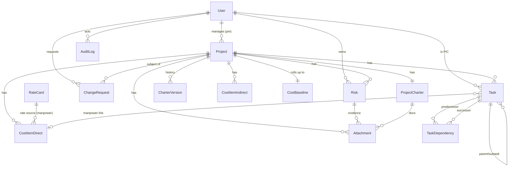

# 🗂️ ERD — PRIMA-PM Database Design
**Version:** 1.0 · **Date:** 2026-06-27 · **DB:** PostgreSQL 16 · **ORM:** Prisma

> Money is stored as `Decimal(18,2)`. Dates as `timestamptz`. Soft-delete via `deletedAt` where relevant.

---

## 1. Entity Relationship Diagram (Mermaid)



---

## 2. Entities & Key Attributes

### User
`id, name, email(unique), passwordHash, role, isActive, createdAt`
Role ∈ {ADMIN, PMO, PROJECT_MANAGER, FINANCE, RISK_OFFICER, TEAM_MEMBER, VIEWER}

### Project
`id, code(unique), name, sponsor, status, pmUserId→User, createdAt`
Status ∈ {DRAFT, CHARTERED, IN_PROGRESS, ON_HOLD, CLOSED}

### ProjectCharter (1:1 Project — current/active version, locked on commit)
`id, projectId(unique), description, goals, category, hiScope,
 hiCostIdr, hiScheduleStart, hiScheduleEnd, hiDeliverables, pmUserId,
 version, locked, committedAt, committedBy`
Category ∈ {NETWORK_INFRA, SERVER_INFRA, CLOUD_INFRA, CYBERSECURITY_INFRA, APP_DEV}

### CharterVersion (immutable snapshots for audit/versioning)
`id, projectId, version, snapshot(JSON), committedBy, committedAt`

### CostItemDirect (Material + Manpower unified, discriminated by `type`)
Common: `id, projectId, type, label, createdAt`
Material fields: `qty, unitCost, amount(=qty×unitCost)`
Manpower fields: `personnelRole(PM|PROJECT_PERSONNEL), resourceUserId?, rateCardId?,
                  unitCostPerManday, planMandays, manpowerCost(=unit×mandays), taskId?`
DirectType ∈ {TECHNOLOGY_ONPREM, TECHNOLOGY_CLOUD, HARDWARE_LICENSE, SOFTWARE_LICENSE, MANPOWER}

### CostItemIndirect
`id, projectId, type, description, amount`
IndirectType ∈ {TRANSPORTATION, ACCOMMODATION, ENTERTAINMENT}

### RateCard (master data)
`id, roleName, level, unitCostPerManday, isActive`

### Risk (Qualitative + Quantitative/EMV)
`id, projectId, code, title, description, category, status, ownerUserId,
 probabilityScore(1-5), impactScore(1-5), riskScore(=P×I), severity,
 probabilityPct(0-1), impactCostIdr, emv(=pct×impact), kind(THREAT|OPPORTUNITY),
 responseStrategy, responseCost, residualEmv, includeInReserve`
Severity ∈ {LOW, MEDIUM, HIGH, CRITICAL}
ResponseStrategy ∈ {AVOID, MITIGATE, TRANSFER, ACCEPT, EXPLOIT, ENHANCE, SHARE}
RiskStatus ∈ {IDENTIFIED, ANALYZING, PLANNED, OPEN, CLOSED, OCCURRED}

### Task / Subtask (self-referencing tree)
`id, projectId, parentTaskId?, wbsCode, name,
 planStart, planEnd, actualStart?, actualFinish?, picUserId?,
 progressPct(0-100), isMilestone, manpowerCostItemId?, sortOrder`

### TaskDependency (FS/SS/FF/SF dependencies)
`id, predecessorId→Task, successorId→Task, type, lagDays`
DependencyType ∈ {FS, SS, FF, SF}

### CostBaseline (1:1 Project — computed roll-up cache)
`id, projectId(unique), directTotal, indirectTotal, contingencyReserve,
 managementReserve, costBaseline, budgetAtCompletion(BAC), updatedAt`

### ChangeRequest
`id, projectId, type, title, description, status, requestedBy, decidedBy?, decidedAt?`
CRStatus ∈ {SUBMITTED, UNDER_REVIEW, APPROVED, REJECTED}

### AuditLog (append-only)
`id, userId, entity, entityId, action, before(JSON), after(JSON), createdAt`

### Attachment (lightweight, polymorphic by ownerType)
`id, ownerType, ownerId, fileName, mimeType, sizeBytes, storageKey, uploadedBy, createdAt`

---

## 3. Calculated/Derived Fields (enforced in service layer + DB defaults)
| Field | Formula |
|---|---|
| CostItemDirect.amount (material) | `qty × unitCost` |
| CostItemDirect.manpowerCost | `unitCostPerManday × planMandays` |
| CostBaseline.directTotal | `Σ material.amount + Σ manpowerCost` |
| CostBaseline.indirectTotal | `Σ indirect.amount` |
| Risk.riskScore | `probabilityScore × impactScore` |
| Risk.emv | `probabilityPct × impactCostIdr` |
| CostBaseline.contingencyReserve | `Σ residualEmv WHERE includeInReserve=true AND kind=THREAT` |
| CostBaseline.costBaseline | `directTotal + indirectTotal + contingencyReserve` |
| CostBaseline.BAC | `costBaseline + managementReserve` |

---

## 4. State Machine — Project Status
```
DRAFT ──(charter commit)──► CHARTERED ──(kickoff)──► IN_PROGRESS ⇄ ON_HOLD ──(finish)──► CLOSED
```
Modules 2–4 are writable only when status ≥ CHARTERED.
