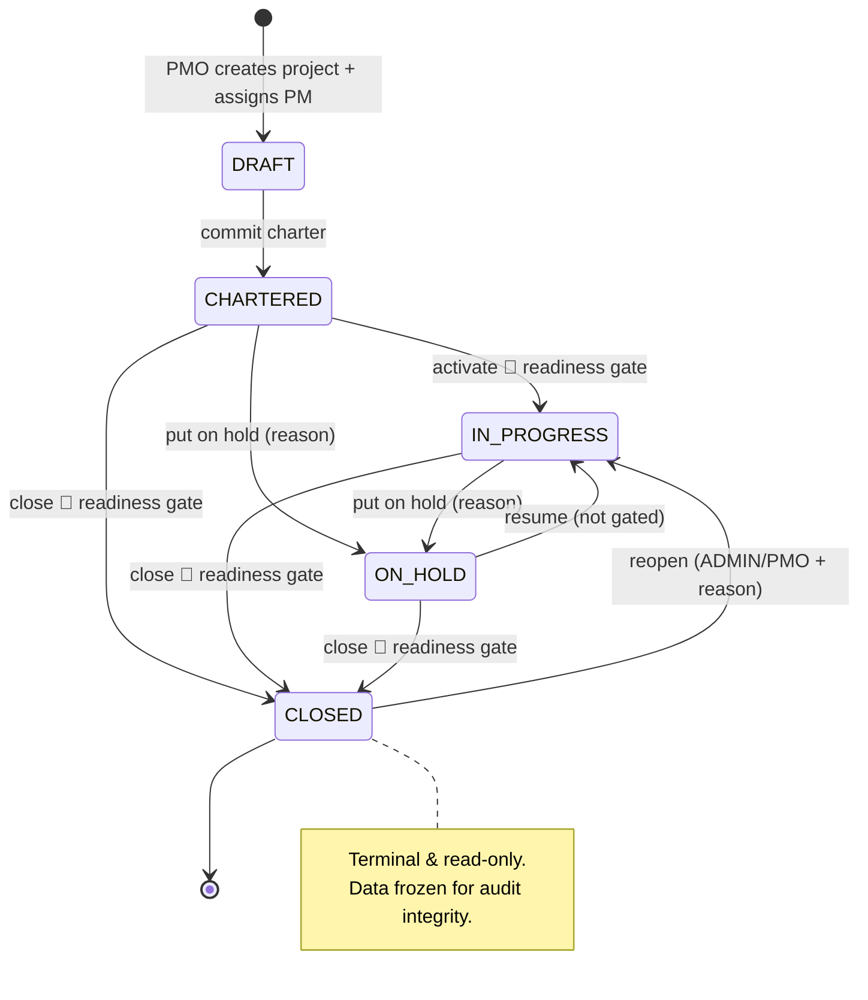
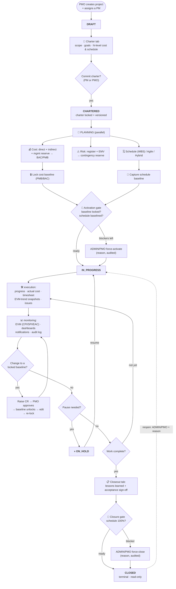
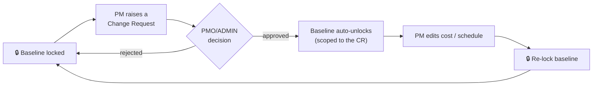

# 🔄 Project Lifecycle & Flow — Prismatix

**Version:** 1.0 · **Date:** 2026-07-06 · **Audience:** PM · PMO · onboarding

> End-to-end flow of a project in Prismatix, from creation to close, mapped to the
> five PMBOK process groups. The app enforces this flow through a status **state
> machine**, three **governance gates** (activation, change control, closure), and a
> contextual **"🧭 Next steps"** guide on every project page.

---

## 1. Lifecycle at a glance (state machine)

Every project holds exactly one status and may only move along legal transitions —
the server rejects illegal jumps (e.g. `CLOSED → DRAFT`, or skipping `CHARTERED`).

| Status | Meaning | Editable? |
|--------|---------|-----------|
| **DRAFT** | Created, charter not yet committed | Charter only |
| **CHARTERED** | Chartered & planning; not executing yet | Full planning (cost/risk/schedule) |
| **IN_PROGRESS** | Executing & being monitored | Progress/actuals always; baseline only via a CR |
| **ON_HOLD** | Temporarily paused (reason recorded) | Same as IN_PROGRESS |
| **CLOSED** | Terminal, read-only | Nothing (reopen to change) |

---

## 2. End-to-end flow (creation → close)

---

## 3. The five phases (PMBOK process groups)

### 3.1 Initiating — `DRAFT`
| | |
|---|---|
| **Who** | **PMO/ADMIN** create the project and assign the PM (a portfolio decision). |
| **Do** | Set identity (code, name, client, sponsor), **delivery approach** (Predictive / Agile / Hybrid), rough cost & revenue. Draft the **Project Charter** (Charter tab). |
| **Gate out** | **Commit charter** → locks the charter, snapshots a **version**, moves status to `CHARTERED`. The **owning PM** may commit. |

### 3.2 Planning — `CHARTERED`
| | |
|---|---|
| **Who** | Owning PM (+ ADMIN/PMO); FINANCE may edit cost lines. |
| **Do** | Build the plan in parallel: **Cost** (direct/indirect/mgmt reserve → **BAC = PMB**), **Risk** (P×I + **EMV** → contingency reserve auto-flows into the cost baseline), **Schedule** (WBS with dependencies, *or* Agile sprints/backlog, *or* Hybrid). |
| **Gate out** | **Lock the cost baseline** (🔒) and — if there's a WBS — **capture the schedule baseline**. This freezes the performance-measurement baseline. |

> **Baseline rule:** `BAC = PMB = direct + indirect + contingency` (excludes management reserve). Once locked, cost/WBS/schedule are frozen; progress & actuals stay open.

### 3.3 The activation gate — `CHARTERED → IN_PROGRESS`
| | |
|---|---|
| **Who** | ADMIN/PMO press **▶ Activate**. |
| **Check** | 🔴 cost baseline locked · 🔴 schedule baseline captured (hard block only when a WBS exists; a warning for pure-agile). |
| **Override** | ADMIN/PMO **force-activate** with a mandatory reason (audited `FORCE_ACTIVATE` vs a clean `ACTIVATE`). |
| **Why** | PMBOK: don't start execution before the baseline is set, or SV/SPI measure against a moving target. |

### 3.4 Executing + Monitoring & Controlling — `IN_PROGRESS`
| | |
|---|---|
| **Execute** | Task **progress** (drives EV) · **Actual Cost** entries (drive AC → CPI) · **Timesheet** (consumed man-days) · **EVM-trend** status snapshots · **Issues**. |
| **Monitor** | **EVM** (CPI/SPI/EAC/ETC/VAC/TCPI on the Forecast tab) · **Portfolio dashboard** (RAG health, "Needs attention") · **Notifications** (overdue, high risk, overrun) · **Audit log**. |
| **Control** | Change to a locked baseline goes through the **change-control loop** (§4). Pause via **⏸ Put on hold** (reason) → **▶ Resume** (not re-gated). |

### 3.5 Closing — `→ CLOSED`
| | |
|---|---|
| **Prepare** | **Closeout tab**: **Lessons Learned** (went well / wrong / recommendation) + **Acceptance Sign-offs** (formal deliverable acceptance by Sponsor/Customer). |
| **Gate** | 🔴 **only hard blocker = Schedule 100%**. Open CRs / high risks / open issues / AC=0 / missing lessons/acceptance are **advisory warnings**, not blockers. |
| **Override** | ADMIN/PMO **force-close** with a mandatory reason (audited `FORCE_CLOSE`); stores `closedAt` / `closedById` / `closureNote`. |
| **After** | `CLOSED` is terminal & read-only. Correct a mistaken closure via **Reopen** (ADMIN/PMO + reason → `IN_PROGRESS`). |

---

## 4. Change-control loop (protecting a locked baseline)

Once the baseline is locked, it can't be edited silently — changes are governed:

This keeps every baseline change **requested, approved, and audited** — not accidental.

---

## 5. Who does what (separation of duties)

| Action | Owning PM | PMO / ADMIN | FINANCE |
|--------|:--:|:--:|:--:|
| Create project & assign PM | — | ✅ | — |
| Draft & **commit** charter | ✅ | ✅ | — |
| Build cost / risk / schedule | ✅ | ✅ | cost only |
| **Lock / unlock cost baseline** | ✅ | ✅ | — |
| Raise a Change Request | ✅ | ✅ | — |
| **Approve** a Change Request | — | ✅ | — |
| **Activate / Close / Reopen / On-hold** | — | ✅ | — |
| Reassign PM / edit project details | — | ✅ | — |

> **Principle:** the PM does the project work; the PMO holds the governance gates —
> *except* baseline-lock, which the owning PM controls (they build the cost breakdown).

---

## 6. Glossary (key terms)

| Term | Meaning |
|------|---------|
| **BAC / PMB** | Budget at Completion = Performance Measurement Baseline (direct + indirect + contingency; **excludes** management reserve). |
| **EV / PV / AC** | Earned Value · Planned Value · Actual Cost. |
| **CPI / SPI** | Cost / Schedule Performance Index (`EV/AC`, `EV/PV`); ≥ 1 is good. |
| **EAC / ETC / VAC / TCPI** | Estimate at Completion · to Complete · Variance at Completion · To-Complete Performance Index. |
| **EMV** | Expected Monetary Value of risks → drives the contingency reserve. |
| **Baseline** | The frozen cost + schedule the project's variance is measured against. |
| **Readiness gate** | An automated checklist that must pass (or be force-overridden with a reason) before a lifecycle transition. |

---

*Related: [`ERD.md`](./ERD.md) (data model). This document reflects the app behaviour as of 2026-07-06.*
