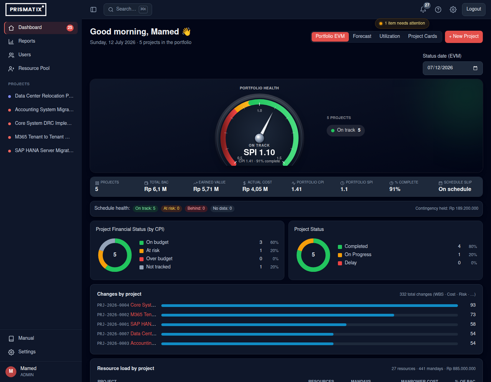
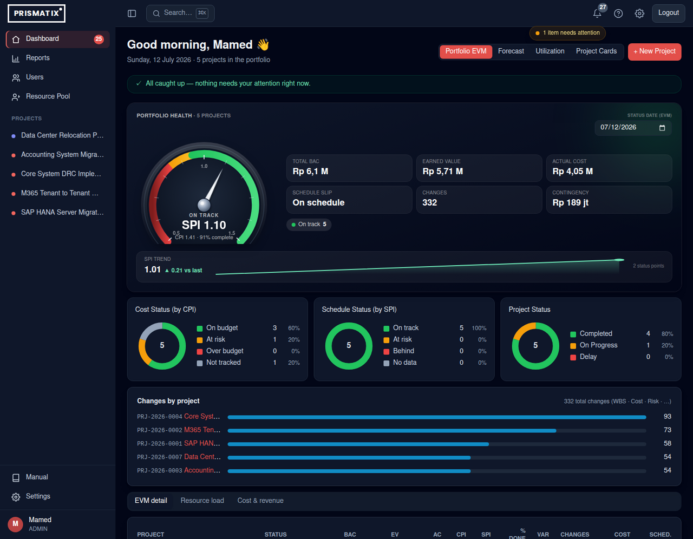

# Dashboard redesign — Portfolio EVM (desktop)

A UX pass on the PMO **Portfolio EVM** dashboard to make it **tighter and more
informative**: less wasted space, no duplicated numbers, and "what needs my
attention" leading the page.

## Before → After

Both captured at the same viewport (1440 × 1120). Notice how much more fits in the
same vertical space after the redesign — the *before* barely reaches the first of
three stacked tables, while the *after* already shows the action-center, the full
command bar, the SPI trend, all three pies, the change activity, and the tabbed
detail table.

### Before

### After

## What changed

| # | Change | Why |
|---|--------|-----|
| 1 + 2 | **Command bar** — the status-date row, the ~40 %-empty gauge card, the 8-cell KPI strip and the schedule-health bar are consolidated into **one** dark hero: gauge (health) + money/scope KPI grid + dark status-date + RAG chips. | Collapsed ~700 px across 4 cards into ~330 px in 1. |
| 2 | **De-duplication** — SPI / CPI / % complete now live *only* in the gauge readout; the project count only in the header. | The old layout repeated these 2–3×. |
| 3 | **SPI trend sparkline** in the hero (▲/▼ vs the previous status point). | Answers *"are we improving?"* — the one thing a static gauge can't show. |
| 4 | **Action center** strip at the very top — governance queues (to approve · to baseline · to activate · to close) as count chips, or an "all caught up" affirmation. | Attention leads the page instead of being buried below the fold. |
| 5 | **Tabbed detail tables** — Resource load · Cost & revenue · EVM share one tabbed panel (EVM default). | Was 3 stacked full-width tables (~2–3 screens of scroll). |
| 6 | **3-column pies** — added *Schedule Status (by SPI)* beside *Cost Status (by CPI)* and *Project Status*. | A balanced cost → schedule → status read that fills the row. |

## Bonus — the health gauge

The portfolio-health indicator is a bespoke **3D speedometer** (`HealthGauge`,
shared by mobile + desktop): a red → amber → green dial whose needle points to
portfolio **SPI**, with SPI scale labels (0.5 / 1.0 / 1.5) and a car-dashboard
**self-test sweep** (min → max → value) on first appearance.

## Net effect

- **Tighter:** the top third dropped from ~1,400 px to ~700 px.
- **Informative:** attention-first, trend added, no repeated numbers.
- Fully responsive; the desktop e2e suite stays green.
