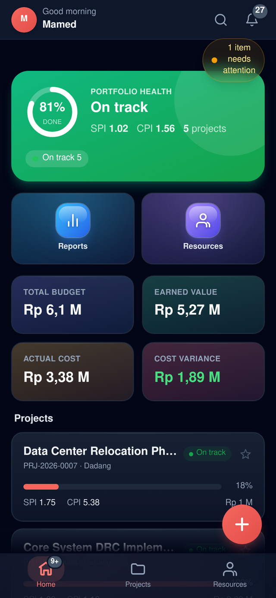
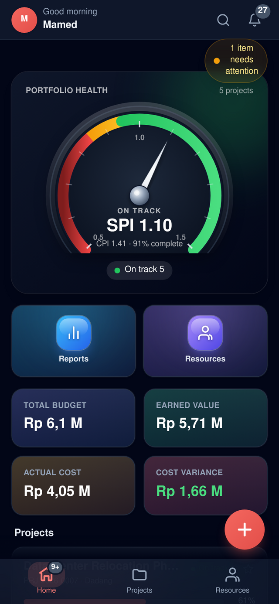
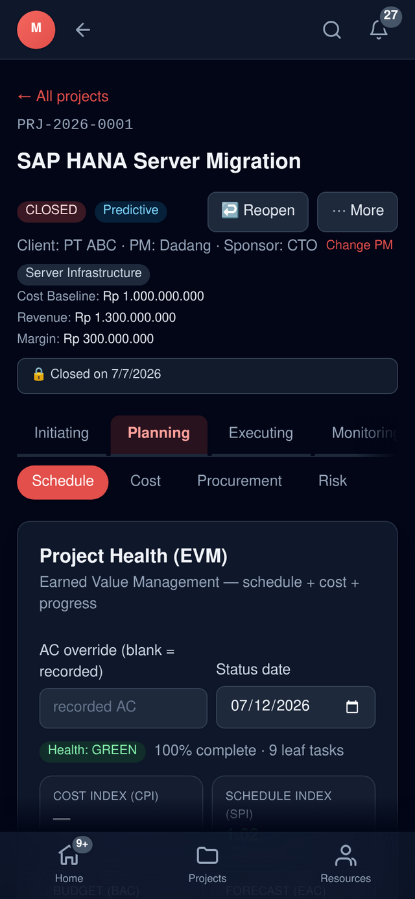
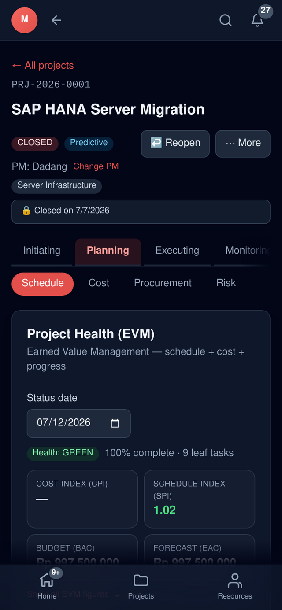
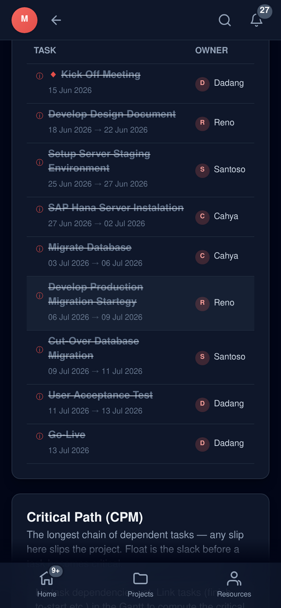
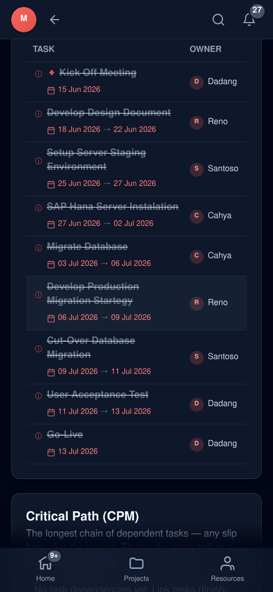
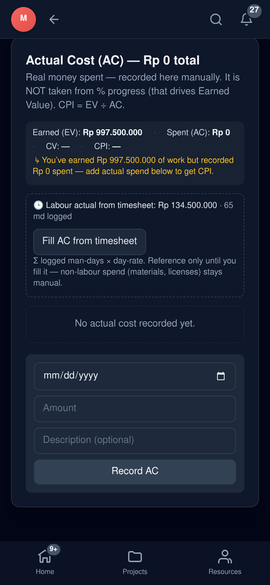
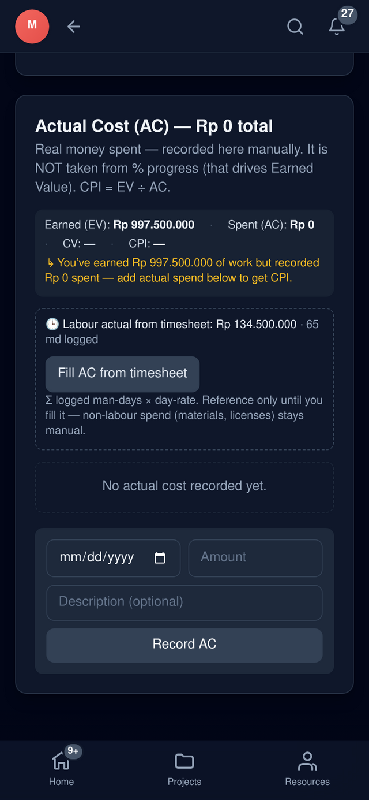

# Mobile UX pass — before / after

A companion to the [dashboard redesign](./dashboard-redesign.md), covering the
phone experience: a bespoke health gauge, a decluttered project header, readable
WBS dates, and compact date pickers across every form. All shots are at 390 px
(iPhone-class), captured live.

## 1. Portfolio health — donut → 3D speedometer

The mobile dashboard hero replaced the flat "% done" donut with a bespoke **3D
speedometer** (`HealthGauge`): a red → amber → green dial whose needle points to
portfolio **SPI**, with a car-dashboard self-test sweep on load. Same component
now powers the desktop dashboard too.

| Before | After |
|:------:|:-----:|
|  |  |

## 2. Project header — decluttered

On phones the header now shows only what matters — **PM + category** — instead of
the full Client · PM · Sponsor line plus the Cost Baseline / Revenue / Margin
breakdown (those live in the Cost tab).

| Before | After |
|:------:|:-----:|
|  |  |

## 3. WBS — schedule dates now visible

The Start/Finish columns are desktop-only, so on phones the dates were dropped.
They now render **inline under each task** with a calendar icon in the brand
colour (a single date for milestones) instead of the faint grey that was easy to
miss.

| Before | After |
|:------:|:-----:|
|  |  |

## 4. Date pickers — compact, not full-width

Native `type="date"` inputs used to stretch full-width and dominate every form.
They're now paired with an adjacent field (or width-capped) across Cost,
Timesheet, WBS, Procurement, Forecast, EVM-Trend, Closeout, Charter, Risk and
Issues. Example — the Cost "Record AC" form:

| Before | After |
|:------:|:-----:|
|  |  |

## Also shipped on mobile

- Installable **PWA** (Add to Home Screen) + iOS-style bottom tab bar, FAB,
  pull-to-refresh, haptics, swipe-nav.
- Card-based layouts for every dense table (Cost, Timesheet, Dashboard, Reports).
- Requirements-traceability tab and the rest of the app, fully responsive.
